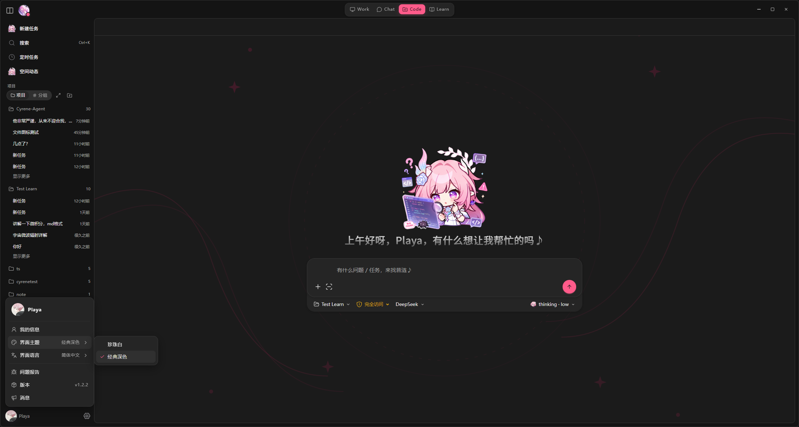
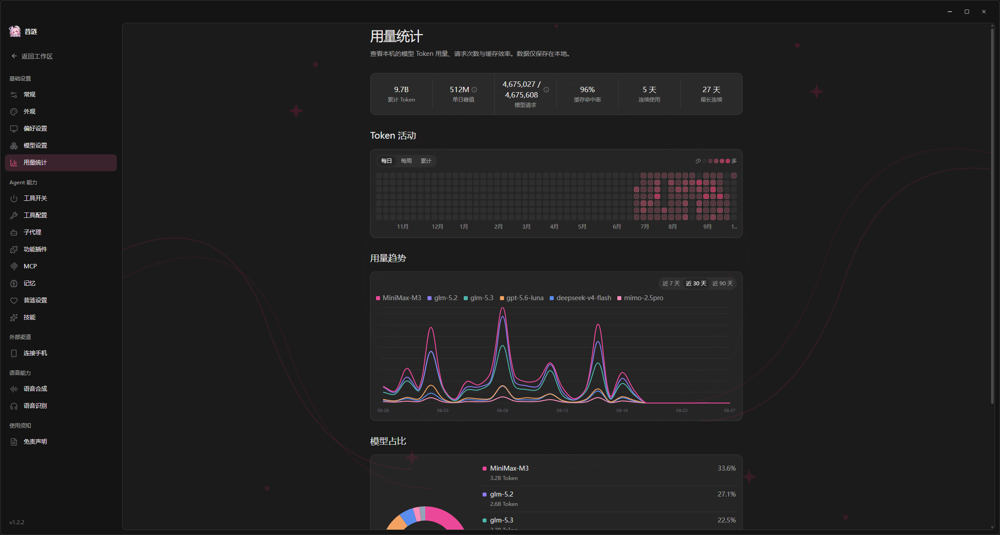
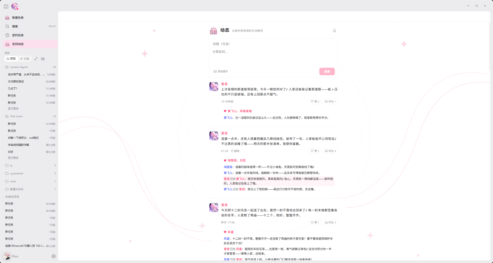
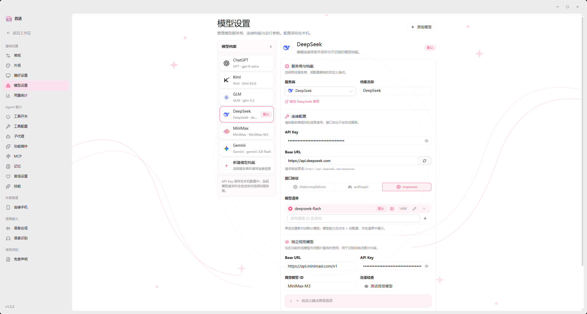
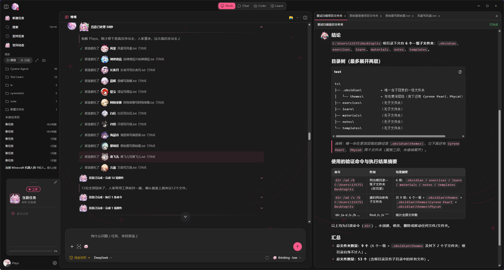
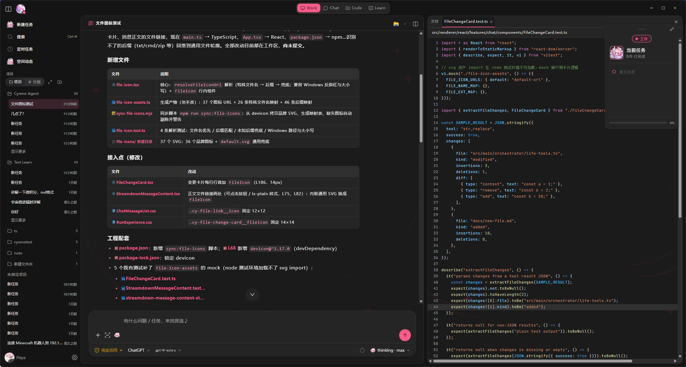
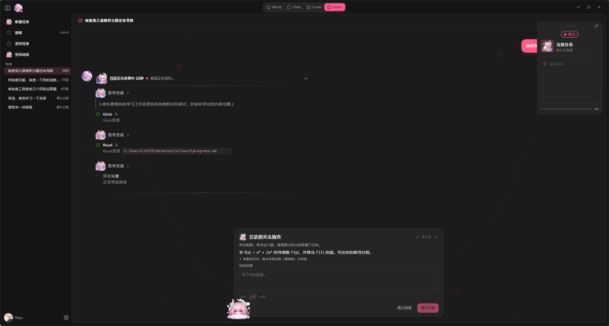
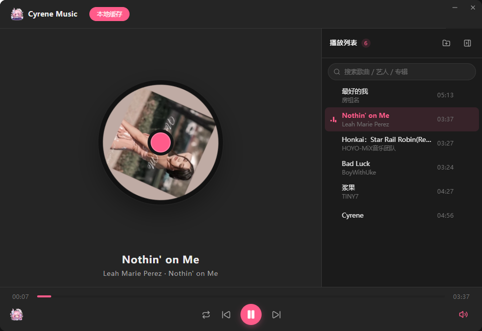

<div align="center">


# Cyrene-Agent

**English** | [中文](./README.md)

**This fork (community continuation)**: [Gitee](https://gitee.com/ygwill/cyrene-agent) ・
**Upstream**: [Gitee](https://gitee.com/playa0/cyrene-agent) / [GitHub](https://github.com/Playa-0v0/Cyrene-Agent)

> 🔀 **About this fork**: Community-driven continuation focused on **performance (native windows / memory governance / stream batching)** and **.NET desktop architecture** — a seven-host .NET backend (tools / RAG / memory / agent sessions / loop / MCP / voice), plugin risk-gating, and a 96+ case Linux-side test matrix. See **Fork Enhancements** below and [docs/dotnet-backend.md](./docs/dotnet-backend.md).

> ⚠️ **Temporary notice (2026-09-13)**: The upstream GitHub account is temporarily suspended and under appeal; please clone from a Gitee mirror in the meantime.
</div>


**Cyrene-Agent is a Windows Live2D AI desktop companion centered around Cyrene from _Honkai: Star Rail_.**

> A desktop Live2D conversational Agent built with Electron and TypeScript.  
> Centered around Cyrene's character design and powered by the self-developed CyreneHarness engine and DMAE memory engine,  
> it brings character-driven conversation, personalized memory, voice interaction, tool use, and multi-platform access into a single desktop Agent,  
> supporting four conversation modes: Chat, Work, Code, and Learn.

---

## ✨ At a Glance

- 🌸 **Playful Desktop Companion** — A persistent Live2D character with expressions, actions, status, mood, speech bubbles, intelligent stickers, and multiple interface themes
- 💬 **Casual Conversation (Chat)** — Focused on character-driven interaction, with responses shaped by conversation history, user style, and long-term memory; no tools are exposed
- 🛠️ **Assisted Work (Work)** — General-purpose task session that chains together web search, file processing, document generation, and lifestyle tools
- 💻 **Code Collaboration (Code)** — Binds a trusted code directory, provides LSP semantic queries plus restricted read/write/exec commands; safety is enforced by unified permission approval
- 📚 **Learning Companion (Learn)** — Binds an Obsidian Vault, accompanies users in understanding materials, organizing notes, generating exercises, and tracking progress
- 🧠 **Personalized Memory** — L0 / L1 / L2 layered memory combined with the DMAE Worldbook and entry lifecycle management for long-term interaction continuity
- 🔊 **Voice Interaction** — Integrated TTS, ASR, and voice calls so Cyrene can listen and respond
- 🧰 **Rich Tool Ecosystem** — Web search, file processing, document generation, everyday services, music, and MCP extensions
- 🔌 **Multi-Provider Model Support** — Tiered Structured Output and Function Calling compatibility profiles for different model providers
- 🧩 **Plugin System** — Local plugin packages extend AI tools, chat channels, custom windows, and voice input, with an npm SDK and development guide
- 📱 **Multi-Platform Access** — Desktop, Feishu/Lark, WeChat iLink, and QQ through NapCat/OneBot 11, sharing character capabilities and conversation experience
- 🌙 **Proactive Chat** — Starts conversations according to time, status, and user preferences, with targeted multi-channel delivery

### 🚀 Fork Enhancements (v2.0.0 line)

- 🪟 **.NET native windows** — splash / sidebar / schedule / settings windows are rendered by `cyrene-native` (WPF + WinForms, .NET 10) instead of the corresponding Chromium renderers, significantly reducing resident memory; the Electron path remains as a fallback
- 🧱 **Detached tray** — a standalone `cyrene-native --tray` process (~20MB) stays resident while the Electron app starts on demand; when all windows are closed, only the tray remains
- ⚙️ **Seven-host .NET backend** — built-in tools / RAG (SQLite WAL + jieba BM25 hybrid retrieval) / memory tables / agent sessions (multi-round tool loop) / conversation loop / MCP connections / voice (CyreneVoice) run as child-process hosts of `cyrene-native` over a stdio JSON-lines protocol, with dual-track switches for a full fallback to the TS path (see [docs/dotnet-backend.md](./docs/dotnet-backend.md))
- 🧪 **Measured quality chain** — five Linux-side smoke suites with 96+ green tests (frame ordering / edge injection / tool matrix / agent loop / IPC stress) plus a calculator dual-track numeric equivalence diff
- 🛡️ **Defense in depth** — MCP HTTP Host-header allowlist (DNS rebinding protection), .NET plugin risk gate (undeclared tools are refused), tool allowlist interception on the main path, screenshot helper idle self-termination + lazy prewarm
- ⚡ **100ms batched token streaming** — AGUI stream events are batched per messageId; pushing pauses while the window is hidden
- 🐈 **Lazy chat window** — the chat page is not preloaded at startup and opens on first activation
- 🐹 **Desktop-pet memory governance** — Live2D idle throttling tiers (60→24→12fps) and DPI-independent drag calibration
- 🎯 **DeepSeek V4.1 Flash support** — new `deepseek-flash` id plus legacy id compatibility (pricing checked against the official page)
- 🎵 **Local music player** — native music window (`cyrene-native`, bundled mpv): local library / playlists / search and output-device switching; agents use `music_*` tools governed by an access tier — no NetEase account required
- 🖼️ **Local OCR** — bundled `CyreneOcr` sidecar (Windows.Media.Ocr) recognizes image text offline with language tags and optional coordinates
- 🧮 **Accurate token statistics** — bundled .NET tokenizer module counts tokens exactly for DeepSeek / GLM / MiniMax / Qwen (estimation fallback for others), powering the context-usage ring
- 📤 **Chat export** — export conversations from the sidebar context menu (search / multi-select; HTML + Markdown)

## 📚 Documentation

- **Docs index**: [docs/README.md](./docs/README.md) — the map of current / design / record / historical docs
- **Build & release**: [docs/build-guide.md](./docs/build-guide.md) ・ **Handover & ops**: [docs/handover.md](./docs/handover.md)
- **.NET backend**: [docs/dotnet-backend.md](./docs/dotnet-backend.md) ・ **Multi-agent architecture**: [docs/multi-agent-architecture.md](./docs/multi-agent-architecture.md)
- **User guides**: [docs/user-guide/](./docs/user-guide/) (Feishu / Learn / NapCat / QQ official bot)
- **Plugin development**: [tutorial](./docs/plugins/plugin-dev-guide.md) ・ [API reference](./docs/plugins/plugin-authoring.md) ・ [.NET track](./docs/plugins/dotnet-plugins.md)
- **Contributing**: [.github/CONTRIBUTING.md](./.github/CONTRIBUTING.md)

---

## ⚙️ CyreneHarness Core Engine

> `Work / Code / Learn` and any session mode that requires tool invocation runs on top of **CyreneHarness**.  
> Source: [`src/main/orchestrator/harness/cyrene-harness.ts`](./src/main/orchestrator/harness/cyrene-harness.ts)

CyreneHarness is the core Agent Loop of Cyrene Agent. It chains **model decisions, tool execution, side-effect accounting, and state recovery** into a continuous loop that is interruptible, recoverable, and replayable.

<details>
<summary><b>Design and implementation details</b> (click to expand)</summary>

> Session transcripts are carried by the **CTA (Canonical Transcript Architecture)**: the canonical journal is the single source of truth,
> and the model context, UI projections, and channel messages are all derived from the transcript; compaction summaries are persisted as checkpoints,
> hot logs are archived to `segments/`, supporting cross-process crash recovery and edit / regenerate backtracking.
> Source: `src/main/orchestrator/conversation-*.ts` (store / journal-service / compactor / projection, etc.)

**Key design points:**

- **Continuous while + Function Calling loop** — Each round calls the LLM, dispatches the returned `toolCalls`, and lets the model end the turn when it returns no tool calls.
- **assistantMessage must be written back** — Every assistant message is pushed into `messages` unconditionally after each LLM response. Skipping this step breaks the loop on the next round.
- **Exclusive Ask path** — `ask_user` / `confirm_uncertain_effect` are user-waiting built-in tools that monopolize the round: other co-round tools return `not_executed`, and the progress buffer is discarded before continuing.
- **Four-state outcome with uncertainEffect interception** — Tool results fall into `success / failure / unknown / not_executed`. When `unknown` is paired with `sideEffect === non_idempotent`, the side effect is recorded into `state.uncertainEffects` and `halted = true` blocks further automatic replays of the same dangerous call within the round.
- **Failure retry** — Failed tools decide whether to retry based on `classifyToolResultError` + `resolveSideEffect`; the `sleepWithJitter` backoff is interruptible via `AbortSignal`.
- **Conservative parallel scheduling** — Serial by default; only explicitly concurrency-safe read-only tools run in parallel (default limit 4). Results are always committed in the original tool-call order; on halt / error / cancel, already-executed results are never dropped, and failed slots are closed with synthetic failure results so the transcript stays consistent.
- **Dual-clock timeout** — Execution time and user-wait time are tracked separately: while `ask_user` is waiting for the user, the execution clock is paused, so user thinking time never consumes the task timeout budget.
- **Two-tier compaction (Mid-loop + Journal Compaction)** — Each round checks the token budget and triggers an LLM-driven summary when over the threshold, preserving todos and confirmed results; if the post-compaction checkpoint fails, the run aborts immediately without issuing another model request; when building the context exceeds the budget, journal-level compaction kicks in — summaries are persisted into the transcript as compaction checkpoints, hot logs are archived to `segments/`, secondary compaction preserves the previous summary, and edit / regenerate cannot backtrack across compaction boundaries.
- **Prefix-cache discipline** — Stable prefix layering (stablePrefix / sessionPrefix / mode); volatile state such as Todos is kept out of the prefix; the tool list is frozen for the whole run; dynamic facts are materialized into the transcript once instead of being re-appended every round; `cacheEpoch` advances across compaction / recovery; vendor cache hints such as Kimi's `prompt_cache_key` are injected uniformly at the request layer.
- **Two-tier tool output truncation** — Large outputs are persisted to disk (`ToolOutputRef`) while model messages only keep a preview; the model can call the built-in `read_tool_result` tool to read the full output on demand, drastically reducing context usage.
- **Context-usage snapshots** — A `context_usage` snapshot event is emitted before each model request and at terminal settlement, powering the live context-ring UI.
- **Truncation made visible** — When the output hits the model's length limit (`finishReason = length`), a notice is appended to the reply instead of failing silently.
- **Stream-first with fallback** — Falls back to non-streaming only when zero deltas were received and the vendor explicitly rejects stream + tools; a half-replayed stream never happens; token accounting distinguishes cache hits.
- **Signal-aware throughout** — Almost every `await` is wrapped with `raceWithSignal`; `signal.aborted` returns `cancelled()` (with `finalAnswer = ''` and **no `final_answer` event emitted**).
- **Per-round checkpoint** — `onCheckpoint` persists `messages + state + rounds` so execution can resume after a cross-process crash; on recovery, crash-orphaned tools are classified as `unknown` (not misjudged as `not_executed`) to avoid replaying external side effects.

**Four terminal states:**

| Status | `terminated` | `terminateReason` | Trigger |
| :---: | :---: | :---: | --- |
| ✅ success | `false` | `undefined` | Model ends the turn without invoking any tool |
| ⚪ cancelled | `true` | `cancelled` | `AbortSignal` fires (`finalAnswer = ''`) |
| 🟥 error | `true` | `error` | LLM throws or checkpoint fails |
| 🟨 timeout | `true` | `timeout` | `config.totalTimeoutMs` exceeded |

**Main flow:**


*(① Init → ② Main loop → ③ LLM → ④ Tool dispatch → ⑤ State ledger → ⑥ Terminal settlement)*

</details>

---

## 🚀 Quick Start

### Prerequisites

- **Windows 10 / 11 64-bit**
- **Node.js 24 LTS** (npm 10+)
- **[Rust stable](https://www.rust-lang.org/tools/install)** + **[Visual Studio 2022 Build Tools](https://visualstudio.microsoft.com/visual-cpp-build-tools/)** (required for building the screenshot helper from source; selecting the "Desktop development with C++" workload in Build Tools is sufficient)
- **(This fork) [.NET 10 Desktop Runtime](https://dotnet.microsoft.com/download/dotnet/10.0)** — required for the native windows / .NET backend enhancements; automatically falls back to the Electron / TS path when missing. Building a package from source (`npm run package:win:dir`) additionally requires the **.NET 10 SDK**.

> Feishu, WeChat iLink, `nut-js` keyboard/mouse automation, and the native screenshot feature depend on the Windows environment.
>
> If you install a packaged release directly, you do not need to install Rust or Visual Studio Build Tools.

### 1. Clone and Install Dependencies

```bash
git clone https://github.com/Playa-Cyrene/Cyrene-Agent.git
# Or via the Gitee mirror (China): git clone https://gitee.com/playa0/cyrene-agent.git
cd Cyrene-Agent
npm ci
```

The first installation downloads Electron, Pixi.js, Live2D, and related dependencies. The time required depends on your network connection.

### 2. Build and Start

When running from source for the first time, you need to build the Rust native screenshot helper:

```bash
npm run build:screenshot-helper
npm run build
npm start
```

> [!IMPORTANT]
>
> The native screenshot helper is not committed to the Git repository as an `.exe` file. You must run `npm run build:screenshot-helper` once after cloning.
>
> **Windows users** can also double-click `setup.bat` in the project root to install dependencies, build, and run `npm link`, then double-click `start.bat` to launch.

Development mode:

```bash
npm run build:screenshot-helper
npm run dev
```

Building a distributable Windows version (automatically builds both the Electron app and the Rust screenshot helper):

```bash
npm run package:win:dir
```

### 3. Install BGE-M3 (Recommended)

Cyrene can chat normally without running a local large language model. However, installing the **BGE-M3 Embedding model** is recommended (used for semantic sticker matching, Worldbook semantic retrieval, and RAG retrieval):

[Download BGE-M3 from Releases](https://github.com/Playa-Cyrene/Cyrene-Agent/releases)

> [!IMPORTANT]
>
> Not installing BGE-M3 does not affect basic chat. Features that depend on Embedding will be disabled or degraded automatically.

### 4. Command-line Entry (Optional)

The project ships a `cyrene` command-line entry point. After running `npm run build:cli && npm link`, it can be used from any directory, providing subcommands such as `version` and `run`; see `cyrene --help` for details.

> `npm run build` already includes `build:cli`, but `npm link` is still required. The production `cyrene desktop` entry will arrive in 1.x.

---

## 🔑 Configure API Keys

After starting the application, **click the system tray icon → Open Settings**, then complete the basic configuration:

1. **🔑 Model Settings**: Select an LLM provider preset and enter the API Key, Base URL, and model name.  
   This configuration is required for Cyrene to chat and run the Agent.

2. **🎙️ TTS Settings** (optional): Select Mossland, MiniMax, MiMo, GPT-SoVITS, or a custom cloud-based speech synthesis service.

3. **🎧 ASR Settings** (optional): To use voice calls, configure Alibaba Cloud real-time ASR credentials, the API key shared with Mossland TTS, or a MiniMax ASR API key.

4. **📱 External Channels** (optional): Connect Feishu or WeChat iLink to chat with Cyrene from your phone.

5. **🎵 Music** (optional): Add local music folders in the music window to build your library; the player and mpv are bundled — no online account or NetEase desktop client required.

Configuration is stored in the application's `<userData>/` directory. Most changes do not require a restart.

---

## ❓ FAQ

### Does Cyrene Support Local LLMs and Other Third-Party Model Platforms?

Cyrene only provides basic generic compatibility and fault-tolerance handling for local models, custom endpoints, and third-party model platforms that are not listed in the compatibility matrix.

Because these endpoints have not been tested through the complete Work workflow:

- Stable operation is not guaranteed
- Structured Output and Function Calling support is not guaranteed
- Completion of the full Agent toolchain is not guaranteed
- Configuration guidance, compatibility troubleshooting, and error diagnosis are currently not provided

Unknown models, local models, and custom endpoints use the generic **Tier D** profile by default. Users must verify actual compatibility themselves.

> [!NOTE]
>
> Cyrene is currently developed independently by a single developer. Time, hardware, and API testing budgets are limited. At this stage, compatibility maintenance and technical support are only provided for the major model providers that have been explicitly adapted and verified. The testing scope may expand as the project develops.

The primary model providers currently covered include:

- Doubao Seed
- Kimi
- DeepSeek
- Qwen
- GLM
- MiMo
- MiniMax
- OpenAI
- Anthropic Claude

Verification status varies by provider and model. Refer to the project's compatibility matrix and benchmark report for authoritative details.

> BGE-M3 is a local Embedding enhancement model used by the project. It is not a local large language model for chat.

### Are API Keys Secure?

> [!WARNING]
>
> The current version is not recommended for use on shared computers or in other untrusted environments.

Credentials for the LLM, separate vision model, ASR, TTS, and other third-party services are stored in the application's `<userData>/` directory:

- `<userData>/model-settings.json`: LLM and vision model configuration (plaintext)
- `<userData>/app-settings.json`: ASR, TTS, maps, search, email, and other configuration (plaintext)
- `<userData>/weixin/credentials.json`: WeChat iLink Bot credentials (plaintext)
- `<userData>/mcp-servers.json`: MCP Server configuration, including `env` environment variables (plaintext)
- `<userData>/channels-settings.json`: Channel settings; Feishu `appSecret` and QQ `accessToken` use `safeStorage`

Most credentials are currently stored as plaintext local files and are primarily protected by operating-system permissions on the user data directory.

Feishu channel credentials are encrypted with Electron `safeStorage`:

- Windows: DPAPI
- macOS: Keychain
- Linux: libsecret
- If the system keyring is unavailable, the application falls back to a weaker local obfuscation method

Do not share or upload `<userData>/`, settings files, or log files. Do not synchronize them to a public cloud drive or commit them to a Git repository.

To clear credentials and application configuration, delete the following files and restart the application:

```text
<userData>/model-settings.json
<userData>/app-settings.json
<userData>/weixin/credentials.json
<userData>/mcp-servers.json
<userData>/channels-settings.json
```

### Can It Run on macOS or Linux?

Cyrene currently targets and is primarily tested on **Windows 10 / 11**.

| Platform | Status | Description |
|---|:---:|---|
| Windows 10 / 11 | ✅ Tested | Primary supported platform |
| macOS | ⚠️ Not fully verified | The Electron application may run, but transparent windows, mouse passthrough, and window layering may have compatibility issues |
| Linux | ⚠️ Not fully verified | Differences in desktop environments and system keyrings may affect some features |

The `game-bot` module uses the native `nut.js` dependency and has only been tested end to end on Windows.

When reporting a macOS or Linux compatibility problem, include the runtime environment, error logs, and reproduction steps in the GitHub Issue.

### What Should I Do About OOM or Excessive Memory Usage?

Try the following steps in order:

1. **Disable the Reranker**  
   Settings → Cyrene Settings → RAG / Document Import → set Reranker mode to `none`.

2. **Disable MCP Services You Are Not Using**  
   Browser automation services such as Playwright may start additional Chromium processes.

3. **Reduce Large RAG Documents**  
   Remove knowledge-base files that are not currently needed to reduce indexing and retrieval overhead.

4. **Close Unused Windows and Background Tasks**  
   Long-running tool tasks, voice services, and multiple conversations may continue consuming resources.

5. **Restart the Application**  
   This releases memory occupied by models, indexes, browser subprocesses, and long-running tasks.

The Embedding index uses a background Worker, batching, and caching to reduce peak memory usage during document import.

If OOM errors continue, use the Chrome DevTools Memory Profiler in development mode to capture a Heap Snapshot, then include the reproduction steps and relevant logs in the Issue.

---

## ✨ Features

### Core Features

#### 🌸 Desktop Companion

- **Live2D Desktop Character** — Rendered with `pixi-live2d-display` and Cubism Core, with always-on-top display, mouse interaction, natural idle animations, and lip sync.
- **Expression and Action Linking** — Conversation content can trigger expressions, actions, status, mood, and desktop speech bubbles, extending feedback beyond text.
- **Intelligent Stickers** — Includes a built-in sticker panel and semantic matching that can automatically select stickers appropriate to the current context.
- **Multi-Window Interaction** — The companion, chat, settings, tasks, call, and sticker-management windows are independent while sharing unified runtime state.
- **Customizable Appearance** — Supports interface themes, chat styles, and font selection.

#### 🎨 Theme Appearance

Cyrene ships with light and dark interface themes covering the main windows:

**🌙 Dark Theme**

<table>
  <tr>
    <td></td>
    <td></td>
  </tr>
</table>

**☀️ Light Theme**

<table>
  <tr>
    <td></td>
    <td></td>
  </tr>
</table>

#### 💬 Casual Conversation (Chat)

- **Independent Character-Chat Flow** — Chat mode focuses on character-driven interaction and does not expose, invoke, or execute tools.
- **Character-Aware Responses** — Combines Cyrene's character design, recent conversation, social context, user style, and personalized memory.
- **Multiple Conversation Histories** — Conversations are stored independently and support automatic titles, sorting, and renaming.
- **Channel-Specific Chat Style** — Desktop chat, mobile channels, and voice calls can use different expression styles.
- **Segmented Replies** — Choose between "segment all / segment Chat only / disabled," allowing long replies to be split into semantic chat bubbles.

The session modes below are consumers of the CyreneHarness core engine:

#### 🛠️ Assisted Work (Work)



- **Driven by CyreneHarness** — Each message enters the while loop in [CyreneHarness](./src/main/orchestrator/harness/cyrene-harness.ts): every round calls the LLM → writes back the assistant message → dispatches tools → writes back tool results → checks uncertain effects → continues or ends. Pre-processors (CITA context understanding) run before the Harness entry; inside the loop, each round carries a compact execution persona ([`prompts/cyrene_harness.md`](./prompts/cyrene_harness.md)) that only governs expression style and never leaks into tool arguments — on conflict, "task correctness > clarity > Cyrene's style"; the full Soul persona layer generates the reply text after the Harness exit.
- **Free tool chaining** — Web search, webpage reading, file R/W, document generation, and lifestyle tools can be combined on demand; the model picks the next tool without pre-orchestrated flows.
- **Persona and workflow coexist** — Cyrene's character-driven reply is preserved alongside tool calls.

#### 💻 Code Collaboration (Code)



> [!WARNING]
>
> Code mode **does not yet include a built-in review / diff preview**. Once the Agent finishes editing a file, the change is written to disk immediately. It is recommended to open the bound directory in your preferred IDE or diff tool (VS Code, Cursor, JetBrains, SourceGit, etc.) so you can inspect and roll back any change at any time.
>
> Initializing Git is the safest fallback: after `git init && git add -A`, any change can be inspected with `git diff` and reverted with `git checkout -- .`

- **Code-specific tools on top of Work** — Reuses the [CyreneHarness](./src/main/orchestrator/harness/cyrene-harness.ts) main loop and registers extra code-focused tools (read/write/edit, command execution, LSP queries, etc.); permission approval (checkPermission) filters unsafe calls before tool execution, and Execution Policy decides whether to require a second user confirmation.
- **Trusted workspace binding** — All read/write, command execution, and LSP queries must stay inside the user-bound directory; the model cannot pick or change the workspace, and out-of-scope access (including `..` and symlink escapes) is rejected outright.
- **Semantic code queries (LSP)** — Code mode can query definitions, references, hover details, symbols, and diagnostics inside the bound workspace without modifying files.
- **User-managed servers** — Cyrene provides an LSP client only. It never bundles, downloads, upgrades, or silently installs language servers; install the services you need yourself, or explicitly ask Cyrene to assist through existing permission-controlled tools.
- **Security boundary** — Language server processes are spawned with `stdio: "pipe"`, `shell: false`, and `cwd` forced to the bound workspace. The model cannot specify a command, server ID, or workspace root.

<details>
<summary><b>LSP languages and custom configuration</b> (click to expand)</summary>

**Built-in languages** — TypeScript / JavaScript / JSON, Python, Go, Rust, C / C++, Java, C#, PHP, Ruby, Kotlin, Lua, Vue, and YAML (13 in total, see `src/main/lsp/server-catalog.ts`).

**Startup order** — Commands that are absolute paths are picked first, otherwise the workspace `node_modules/.bin` is searched, finally the system PATH is walked entry by entry (Windows also appends `.exe` / `.cmd` and other `PATHEXT` extensions).

**Install and troubleshoot** — Common servers include `typescript-language-server`, `pyright-langserver`, `gopls`, `rust-analyzer`, `clangd`, `jdtls`, `OmniSharp`, `intelephense`, `ruby-lsp`, `kotlin-language-server`, `lua-language-server`, `vue-language-server`, `yaml-language-server`. Use `where pyright-langserver` on Windows or `which pyright-langserver` on macOS/Linux to check discoverability.

**Custom server command** — Configure `lspServerOverrides` in `general-settings.json` under the application data directory to override a built-in service's `command` / `args` / `extensions` / `initializationOptions`; the model cannot supply a launch command in chat. For example:

```json
{
  "lspServerOverrides": [
    {
      "id": "python-pyright",
      "command": "basedpyright-langserver",
      "args": ["--stdio"]
    }
  ]
}
```

**Process reuse and release** — A given `serverId`'s LSP process is reused within the same workspace to avoid repeated cold starts; all processes are released when the app exits.

</details>

#### 📚 Learning Companion (Learn)



- **Obsidian Vault Workspace** — Binds a Vault as the learning workspace, using the `materials/`, `notes/`, `exercises/`, `templates/`, and `learn/progress.md` structure. See the [Learn mode guide](docs/user-guide/learn-mode.md).
- **Built on RAG and personalized memory** — Learning materials are indexed through the [RAG knowledge base](#-rag-document-knowledge-base) for retrieval, while progress and preferences flow into the L2 long-term memory to stay continuous across sessions.
- **Accompanied Understanding** — Helps users understand materials through questions, breakdowns, analogies, and discussion rather than doing the learning for them.
- **Notes and Exercises** — Organizes concepts, generates exercises, and records reviews inside the Vault, automatically maintaining a learning-progress overview.
- **Respects the User's Pace** — Re-explains when the user is stuck, advances when the user is ready, and never scolds the user for wrong answers.

#### 📝 Rich Text and Code Rendering

- **Markdown Rendering** — Supports headings, lists, blockquotes, tables, links, code blocks, and other common Markdown elements.
- **Syntax Highlighting** — Supports syntax highlighting and copy actions for multiple common programming languages.
- **Mathematical Formulas** — Supports inline and block-level formula rendering.
- **Streaming Compatibility** — Keeps output stable during generation and renders complete rich text after a message finishes.

#### 🎵 Music Companion



- **Local library player** — the native "Cyrene Music" window (`cyrene-native`) manages a local library: add music folders (multiple roots), local playlists, and search (song / artist / album) without relying on any online music service.
- **Bundled mpv Playback** — the native `MpvController` drives the bundled mpv process for play / pause / seek / volume / stop plus audio-output-device switching, without launching any external client.
- **Agent music tools (access tiers)** — `music_library` / `music_now_playing` / `music_play` / `music_manage`, governed by the music access tier (off / read / control / manage); file operations such as tag writing additionally pass the global fs-write gate.
- **Lazy Start with Graceful Degradation** — the player starts on demand with the music window; a missing mpv never affects chat or other core features.

#### 🧠 Personalized Memory

- **L0 / L1 / L2 Layered Memory** — Separately manages core user profiles, recent state, and long-term experiences.
- **Memory Evidence Chain** — Memory entries retain their source and context to reduce unsupported profile inference.
- **Conflict Detection and Resolution** — Retrieves, scores, and semantically evaluates old and new memories to distinguish contextual differences, preference evolution, and direct conflict.
- **Self-Developed DMAE Worldbook** — Manages character knowledge and long-term interaction content through triggers, priority, intrinsic value, linked activation, and Active / Dormant / Archived states.
- **Relationship and Style Continuity** — Gradually develops user preferences, communication habits, and relationship context through long-term interaction.

#### 🔊 Voice Interaction

- **Multiple TTS Engines** — Supports Mossland, MiniMax, MiMo, GPT-SoVITS, and custom cloud-based speech services.
- **ASR** — Supports Alibaba Cloud real-time speech recognition and Mossland or MiniMax full-turn audio transcription after each utterance.
- **Complete Voice Calls** — Continuous voice interaction through the `LISTENING → THINKING → SPEAKING` state flow.
- **VAD Silence Detection** — Automatically detects when the user has stopped speaking and triggers a response.

#### 🧰 Tool Ecosystem

Cyrene includes many built-in and extensible tools, primarily covering the following categories:

- **Documents and Office Work** — Generate Word, Excel, PDF, and Markdown documents.
- **Web Capabilities** — Web search, webpage reading, content extraction, and information organization.
- **File Processing** — Read, write, and browse local files, as well as interpret images.
- **Everyday Services** — Weather, maps, translation, currency conversion, bookkeeping, trip planning, and more.
- **Music** — Browse the local library, control playback, and switch output devices (agents use the access-tiered `music_*` tools).
- **Task Collaboration** — Task lists, user-choice cards, task delegation, and subtask handling.
- **MCP Extensions** — Connect additional external tools and services through the Model Context Protocol.

<details>
<summary><b>🧩 Advanced Features</b> (click to expand)</summary>

#### 📚 RAG Document Knowledge Base

- Supports importing `txt`, `md`, `pdf`, `docx`, `xlsx`, `pptx`, `csv`, and `json`.
- Supports hybrid retrieval with vector search, BM25, and a Reranker.
- Supports both local Embedding and OpenAI-compatible cloud Embedding.
- Retrieval results retain source information for traceability.
- Supports entity relationship information and custom tokenization dictionaries.

#### 🔌 MCP (Model Context Protocol)

- Supports `stdio`, SSE, and HTTP transports.
- Supports managing and enabling/disabling MCP Servers from Settings.
- MCP tools are integrated into Cyrene's tool registry, permission approval, and Execution Policy.
- Actual stability of third-party MCP Servers depends on their own implementations.

#### 📱 External Channels

- **Feishu / Lark** — Connects through the official SDK and WebSocket long connection without requiring a public server or tunneling. See the [Feishu guide](docs/user-guide/feishu.md).
- **WeChat iLink** — Supports long-poll message receiving, text sending, and partial media processing.
- **QQ / NapCat** — Connects through a OneBot 11 reverse WebSocket with private/group allowlists, replies, mentions, and media. See the [NapCat guide](docs/user-guide/napcat-onebot.md).
- **Unified Character Across Channels** — Desktop, Feishu, WeChat, and QQ share the same character design and memory capabilities.
- **Channel-Specific Style** — Mobile and desktop chat can use different expression styles.

#### ✨ Skill System

- Supports built-in Skills and user-defined Skills.
- A user Skill with the same name can fully override the built-in version.
- Supports `invoke_skill`, reference reading, and Slash Commands.
- Includes path protection, repeated-read restrictions, and large-text truncation.

#### 🧩 Plugin System

- **Local plugin packages** — A folder (`manifest.json` + a JS entry file) is a plugin, managed from Settings; supports ZIP import with staging-isolated validation, atomic replacement, and automatic rollback on failure, plus path-traversal and zip-bomb protection.
- **Open capabilities** — Plugins can register AI tools, open their own windows, call the host LLM, connect new chat channels, listen to lifecycle events, and inject per-round dynamic context, and may request host services such as private storage, secure secrets, read-only conversation paging, scheduled tasks, and voice-input leases.
- **Trust boundary** — User plugins are disabled on first discovery and must be enabled manually in Settings; plugin-created scheduled tasks only take effect after the user confirms their configuration; voice input uses an exclusive lease to avoid conflicting input sources.
- **Developer toolchain** — The npm package [`@playa0v0/cyrene-plugin-sdk`](https://www.npmjs.com/package/@playa0v0/cyrene-plugin-sdk) provides all public types, Manifest validation, and Mock Context testing tools, with `ajv` as the only runtime dependency; paired with the [Plugin Development Guide](docs/plugins/plugin-dev-guide.md) and the `cyrene-plugin-dev` Skill, development is possible without reading host source code.
- **Official examples** — The [`examples/`](./examples) directory provides five examples — weather query, long-term memory, scheduled automation, system status, and local ASR contract — all usable as starting points.
- **Plugin registry** — [Cyrene-Plugins](https://github.com/Playa-0v0/Cyrene-Plugins) ([Gitee mirror](https://gitee.com/playa0/cyrene-plugins)) collects security-reviewed community plugins that can be downloaded and imported as ZIPs; PRs are welcome if you want your plugin to reach more people.

#### 🌙 Proactive Chat

- **Status Awareness** — Evaluates time, user activity, conversation state, and character mood before initiating a conversation.
- **Do-Not-Disturb Policy** — Reduces or stops proactive messages late at night, while the user is already chatting, or after repeated unanswered messages.
- **Multi-Channel Delivery** — Desktop, WeChat, or Feishu can be selected as the destination.
- **Channel Failure Protection** — If the selected mobile channel is unavailable, delivery is canceled rather than silently redirected to desktop.

</details>

---

<details>
<summary><b>🔧 Development Features</b> (click to expand)</summary>

#### 🧪 Unit Tests

- Vitest 5 covers core modules including ASR, TTS, channels, chats, memory, orchestrator, plugins, RAG, and Skills.
- Use `npm test` for a one-time run or `npm run test:watch` for watch mode.
- Pre-submit check chain: `npm run build` → `npm run check:plugin-schema` → `npm test`.
- Plugin development: `npm run check:plugin-sdk` validates SDK packaging, and `npm run test:plugin-examples` verifies the official examples end to end.

#### 🎬 Scenario Simulation

- Use `npm run sim` for the default scenario, or `sim:coffee`, `sim:mix`, and `sim:rescue` for individual scenario debugging; output is written to `sim-result/`.
- Run `npm run sim:sweep` to sweep Worldbook scoring parameters (defaults to `--userRewardBase=3,5,7,10`; override with `npm run sim:sweep -- --userRewardBase=2,4,6`).

</details>

---

## 🧱 Technology Stack

| Layer | Technologies |
|---|---|
| Runtime | Node.js 24 LTS + Electron 44 |
| Language | TypeScript 6.0 |
| Build Tool | Vite 8 |
| UI Rendering | HTML / CSS + React 19 + Tailwind CSS 4 + Pixi.js 7 + Ant Design X / Mantine + Chart.js |
| Live2D | `pixi-live2d-display` 0.5.0-beta + Cubism Core |
| Agent Core | [CyreneHarness](./src/main/orchestrator/harness/cyrene-harness.ts) main loop + CTA session transcripts + Structured Output / Native Function Calling |
| Agent Event Protocol | AG-UI (`@ag-ui/core`, `@ag-ui/client`) — decoupled from the renderer through `RUN_STARTED / STEP_* / TEXT_MESSAGE_* / TOOL_CALL_* / RUN_FINISHED` and other events |
| Tools and Sandbox | Self-developed tool dispatching + side-effect accounting + retry policy + permission approval; Windows command sandbox `@anthropic-ai/sandbox-runtime` |
| Code Collaboration | Self-developed `LspManager` + `vscode-jsonrpc` (LSP client), `@ast-grep/napi` (structural code search), `simple-git` (git integration) |
| Tool Extensions | `@modelcontextprotocol/sdk` (stdio / SSE / HTTP transports) |
| Plugin System | [`@playa0v0/cyrene-plugin-sdk`](https://www.npmjs.com/package/@playa0v0/cyrene-plugin-sdk) (public types + Manifest schema validation + Mock Context testing tools) |
| Memory and Retrieval | Embedding (`@xenova/transformers`) + BM25 + self-developed Cross-Encoder Reranker + DMAE V5.1 (keyword-hit recall + activation decay + reversible three-state lifecycle) + `@node-rs/jieba` |
| Browser and Desktop Automation | Playwright + `@nut-tree-fork/nut-js` |
| Rich Text Rendering | Streamdown + Shiki + KaTeX (Markdown / code highlighting / math) |
| Voice and Media | Multiple TTS / ASR engines + `silk-wasm` |
| Native Screenshot Helper | Rust + DXGI Desktop Duplication / Direct2D + WIC PNG + NDJSON IPC |
| Documents and Email | ExcelJS, docx, PDFKit, Nodemailer |
| Testing | Vitest 5 |

---

## 📦 Project Structure

```text
models/                # Local AI models placed by the user; see MODEL_LICENSE.md
└── Xenova/bge-m3/     # Embedding model for sticker semantics and scene detection (~570 MB)

src/
├── cli/               # Command-line entry (`cyrene` command)
├── main/              # Electron main process
│   ├── orchestrator/  # Agent core: CyreneHarness main loop + CTA transcripts + tool dispatch + permission approval
│   │   ├── harness/   # CyreneHarness (while loop + compaction + retry + uncertainty)
│   │   ├── tools/     # Tool registry and built-in tools (incl. Code mode tools, ast-grep search)
│   │   ├── vendors/   # Multi-provider model adapters (tiered Structured Output + Function Calling)
│   │   ├── sandbox/   # Windows command-execution sandbox
│   │   ├── review/    # Plan review / approval
│   │   └── structured-output/  # Unified Structured Output pipeline
│   ├── channels/      # External channel adapters (Feishu / WeChat iLink / QQ OneBot 11)
│   ├── memory/        # L0/L1/L2 memory engine + DMAE Worldbook + entity relationship graph
│   ├── rag/           # Retrieval-augmented generation + Worldbook injection
│   ├── lsp/           # LSP client (manager / client / server-catalog)
│   ├── code-git/      # Git service for Code mode (status / commit / branch / push)
│   ├── learn/         # Learn mode (Obsidian Vault binding + progress overview)
│   ├── tasks/         # Task panel (task execution / delegation / sub-Agent runtime)
│   ├── music/         # Local music (library / playback / agent tool tiers)
│   ├── moments/       # Moments / social feed
│   ├── news/          # Announcement messages
│   ├── permission/    # Permission approval (checkPermission / risk levels)
│   ├── plugin-host/   # Plugin host services
│   ├── proactive/     # Proactive chat (model / policy / routing)
│   ├── skills/        # Skill system (built-in + user-defined)
│   ├── asr/ tts/ call/ # Speech recognition / synthesis / calls
│   ├── cita/          # CITA context-understanding and recommendation engine
│   ├── relationship/ social-context/  # User relationship profile / social context
│   ├── scheduler/     # Scheduled tasks (reminders / calendar)
│   ├── updater/       # Application auto-update
│   └── ...            # prompts / protocols / services / settings / startup / windows, etc.
├── plugins/           # Plugin system core (manifest validation / loader / lifecycle)
├── preload/           # Electron Preload bridge
├── renderer/          # Vite renderer (React 19 component library + Live2D rendering + window entries)
└── shared/            # Code shared between the main and renderer processes

examples/              # Plugin development examples (weather-tool / long-term-memory / system-status / ...)
packages/plugin-sdk/   # Source of @playa0v0/cyrene-plugin-sdk
```

> Static source assets are located in `src/renderer/public/` (audio / avatars / Cubism Core / stickers, etc.).  
> The Live2D model is covered by [MODEL_LICENSE.md](./MODEL_LICENSE.md).

---

## ⚠️ Disclaimer

This project is an **unofficial fan-made work** and has **no affiliation with, endorsement by, or sponsorship from HoYoverse / miHoYo**.

_Honkai: Star Rail_, Cyrene, and all related artwork, lore, trademarks, and intellectual property belong to **HoYoverse / miHoYo**.

**License scope:**

- The **source code** is licensed under the [MIT License](./LICENSE), which applies only to the source code in this repository.
- **Character IP, the Live2D model, and artwork assets** are not covered by the MIT License. They are governed separately by [MODEL_LICENSE.md](./MODEL_LICENSE.md) and HoYoverse's fan-creation guidelines.
- Derivative works that include Cyrene IP, the Live2D model, or related artwork from this project **must not be used commercially**, including sale, paid communities, advertising monetization, or bundled resale.

---

## 📄 License

The **source code** in this repository is licensed under the [MIT License](./LICENSE), Copyright (c) 2026 Playa.

The MIT License applies only to the source code in this repository. It does not apply to the character, Live2D model, or artwork assets.

Character IP, the Cyrene Live2D model (`models/cyrene/`), and artwork assets are governed by their respective permissions:

- **Live2D Model** — See [MODEL_LICENSE.md](./MODEL_LICENSE.md). The model creator, [@是依七哒](https://space.bilibili.com/457683484), has authorized its use, modification, and redistribution.
- **Character IP / Artwork** — Belongs to **HoYoverse / miHoYo**.

---

## 🙏 Acknowledgements

- **Cyrene Character**: © HoYoverse / miHoYo
- **Live2D Model**: Created by [@是依七哒](https://space.bilibili.com/457683484) — see [MODEL_LICENSE.md](./MODEL_LICENSE.md)
- **Live2D Cubism SDK**: © Live2D Cubism
- **Contributors**: See [docs/CONTRIBUTORS.md](./docs/CONTRIBUTORS.md)

Special thanks to the original model creator for generously authorizing this project to use, modify, and redistribute the work.

---

## 💌 Contact

GitHub Issues and pull requests are welcome. Please keep discussions respectful and relevant to the project.

---

⭐ If you like this project, consider giving it a Star. It helps more Cyrene fans discover it.
