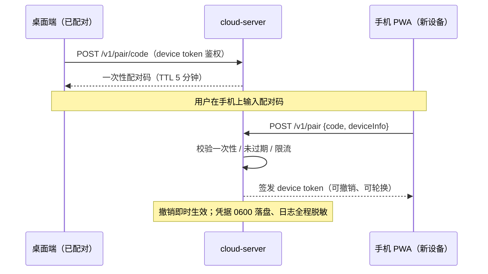
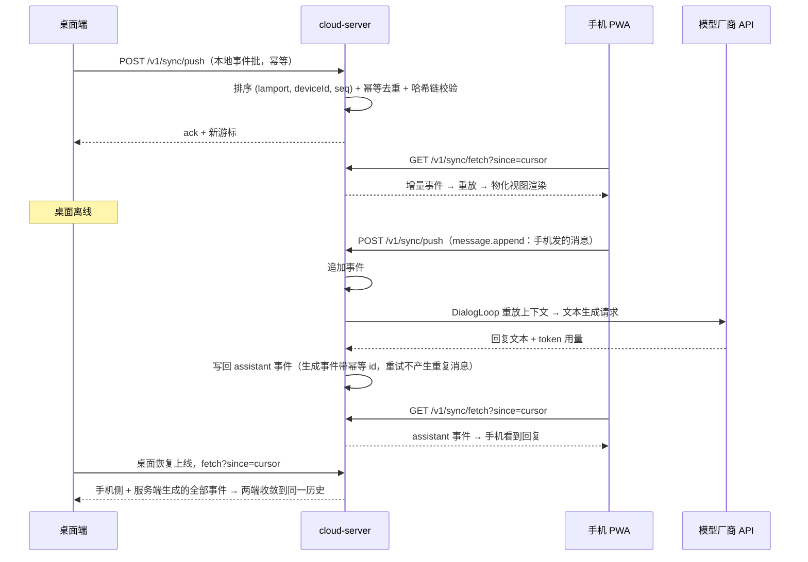

# 云端昔涟：不落 · RFC

> **日期**：2026-10-03
> **状态**：设计草案（进行中——本版先落「总体架构」；协议字段级规范、开放问题决议、Git 类比全文
> 等章节见文末 TODO）
> **关联**：里程碑 [#229292「云端昔涟：不落」](https://gitee.com/ygwill/cyrene-agent/milestones/229292) ·
> 决策 issue [IKJK2F](https://gitee.com/ygwill/cyrene-agent/issues/IKJK2F) ·
> Phase 1（IKJK2G–IKJK2N）· Phase 2（IKJK2O–IKJK2T、IKJK3P）
> **结论先行**：本地优先不变；remote = 用户自建 VPS（.NET 10 + SQLite，2G 内存预算）；
> 会话与记忆以**不可变事件流**同步与重放——离线分叉 = 两段都真实发生过的经历；
> Phase 1 只做文本（同步 + 手机 PWA 查看/续聊 + 服务端生成）；渠道 24/7 上云属 Phase 2。
> **相关文档**：`docs/design/2026-09-21-cta-conversation-transcript-architecture-design.md`（事件源 CTA）、
> `docs/multi-agent-architecture.md`（cyrene-core 的 host 基线）、`docs/dotnet-backend.md`（.NET 宿主现状）

---

## 0. 决策与范围

### 0.1 已拍板（里程碑 D1–D5）

| # | 决策 |
|---|---|
| D1 | 服务端用 **.NET 10**（ASP.NET Core + Microsoft.Data.Sqlite），不用 Node——目标 2G VPS，内存可控可限 |
| D2 | 代码放**本仓库**（同仓不同包）：抽 `dotnet/cyrene-core` 跨平台核心库，新增 `dotnet/cloud-server` |
| D3 | 复用 CTA：本地事件源是 transcript.jsonl，不推翻重来；TS ↔ C# 契约 = JSON Schema + 共享测试向量 |
| D4 | Phase 1 只做**文本**：同步 + 手机查看/续聊 + 服务端生成；渠道 24/7 上云放 Phase 2 |
| D5 | 内存预算：cloud-server 空载 ≤150MB、基准负载 ≤300MB；容器上限 512MB + RSS 告警 |

### 0.2 不变式

1. **本地优先**：没有 remote 时一切照旧；
2. **remote 随时可解绑**，数据永远在用户手里；
3. **事件不可变**，删除 = 追写 tombstone；
4. **无中心真源**，各端重放收敛。

### 0.3 阶段范围

| 阶段 | 内容 | issue |
|---|---|---|
| Phase 1 | 文本同步 + 手机 PWA 查看/续聊 + 服务端生成（模型密钥仅存服务端） | IKJK2G–IKJK2N |
| Phase 2 | 记忆与心情事件化、渠道 24/7（归属权 / 唯一调度 / C# 适配器）、主动消息 | IKJK2O–IKJK2T、IKJK3P |

Phase 1 总纲验收（里程碑）：桌面离线 → 手机打开最近会话发送消息并收到回复；桌面上线后两端收敛到同一历史；
docker compose 一键部署、可升级、备份可恢复；内存达 D5 预算；**现有本地用户体验零变化**。

---

## 1. 总体架构

```text
① 客户端（本地优先不变：没有 remote 时一切照旧）
   桌面端 Electron                                     手机 PWA（浏览器；VPS 零 Node 运行时）
   ├ CTA journal（transcript.jsonl + snapshot.json）    ├ 会话列表 + 消息流 + 发送框（聊天渲染最小集）
   ├ 事件导出器（只读、幂等；含 cyrene-chats 迁移）      ├ 配对登录（兑换 device token）
   ├ 同步客户端（push / fetch / clone）                 ├ fetch / push 客户端
   └ 重放物化视图（会话列表 / 消息流，供 UI 读取）        └ 离线只读缓存
          │                                                │
          └──────────────── HTTPS（Caddy/TLS）─────────────┘
                                 │
② 用户独立 VPC（一台 2G VPS，docker compose 一键部署）
   Caddy ──反代 / Host 白名单──► cloud-server（.NET 10，ASP.NET Core Minimal API，容器上限 512MB）
                                  ├ Auth 中间件：device token 校验 / 撤销 / 限流
                                  ├ Pairing：一次性配对码（TTL 5 分钟）→ 签发 token
                                  ├ Sync API：fetch?since= ｜ push（幂等批）｜ clone
                                  ├ EventStore：SQLite WAL，append-only + 幂等索引 + 哈希链
                                  ├ Materializer：fold 事件 → 会话列表 / 消息流（PWA 与生成共用）
                                  ├ DialogLoop：重放上下文 → 模型厂商 API → 写回事件（密钥仅服务端）
                                  └ ┄┄ Phase 2：Scheduler 唯一调度 ｜ Channel Adapters（C#：微信 / 飞书 / QQ）
   数据卷：events.db(+WAL) ｜ 模型密钥 ｜ 备份        运维：healthcheck / RSS 告警 / 日志轮转 / swap-OOM 策略
                                 │
③ 契约层（TS ↔ C# 的唯一可靠桥梁，IKJK2H）
   事件信封：event_id · session_id · type · lamport · device_id · seq · ts · payload · prev_hash · hash
   类型 v0：session.create / message.append / turn_rewind / tombstone（memory.*、mood.shift 属 Phase 2）
   契约：JSON Schema + fixtures/sync-protocol/ —— TS 与 C# 各实现读取器与校验器，跑同一套测试向量
   排序键 (lamport, deviceId, seq) ｜ 幂等键 event_id ｜ 删除 = tombstone ｜ 重放收敛
```

### 1.1 Git 类比（模型心智）

| Git | 云端昔涟 |
|---|---|
| 本地仓库（object store + refs） | 桌面 CTA journal（transcript.jsonl + snapshot.json，本地权威源） |
| commit | 不可变事件（message.append / turn_rewind / tombstone / …） |
| origin remote | 用户自建 VPS 上的 cloud-server |
| clone / fetch / push | `GET /v1/sync/clone` ｜ `GET /v1/sync/fetch?since=` ｜ `POST /v1/sync/push` |
| merge / rebase | 重放收敛（确定性全序）；离线分叉两段都保留，不做丢分支的强 rebase |

---

## 2. 服务端组件与同仓模块

### 2.1 cloud-server 内部（D2：引用 cyrene-core）

```text
cloud-server（ASP.NET Core Minimal API，容器）
├─ Api/            路由与鉴权：/v1/pair、/v1/sync/*、/healthz、PWA 静态托管
├─ Domain/
│   ├─ Pairing       一次性配对码 → device token（签发 / 撤销 / 轮换）
│   ├─ Sync          push 幂等批处理 · fetch 游标 · clone 全量
│   ├─ EventStore    append-only 写入 · (lamport, deviceId, seq) 排序 · 哈希链校验 · 幂等索引
│   ├─ Materializer  fold(events) → 物化视图（会话列表 / 消息流）
│   └─ DialogLoop    重放上下文 → 生成 → 写回事件（复用 LoopHost/Agents 或最小环，IKJK2M 拍板）
└─ Storage/         SQLite WAL · 备份（Online Backup API）· 密钥（0600；Linux 静态加密方式待定）
```

### 2.2 同仓结构（D2）

```text
dotnet/
├─ cyrene-core/      新：net10.0 类库（HostProtocol / Tools / Rag / MemoryStore / LoopHost / Agents / Mcp）
│                    CI 断言：不出现 net10.0-windows / WPF / WinForms 依赖
├─ native-windows/   改为引用 cyrene-core（Windows-only 边界：DPAPI / 剪贴板 / WinForms 留在本层）
├─ smoke-host/       改引用（删除 Compile Include 链接编译）
└─ cloud-server/     新：ASP.NET Core Minimal API（容器；同时托管 PWA 静态产物）
src/main/sync/       新（TS 侧）：事件导出器 / 同步客户端 / 物化视图（CTA 写入路径零改动）
src/pwa/             建议位置：手机端源码（复用 shared 类型与最小聊天组件），产物进 cloud-server 静态目录
```

---

## 3. 事件模型与存储（草图，字段级规范以 IKJK2H 定稿为准）

```sql
events(
  event_id    TEXT PRIMARY KEY,   -- 幂等键（CTA entryId 映射）
  session_id  TEXT NOT NULL,
  type        TEXT NOT NULL,      -- v0 四类；Phase 2 增 memory.* / mood.shift
  lamport     INTEGER NOT NULL,   -- 端侧逻辑时钟
  device_id   TEXT NOT NULL,
  seq         INTEGER NOT NULL,   -- 端侧单调序号
  ts          TEXT NOT NULL,
  payload     TEXT NOT NULL,      -- JSON；presentation patch 随事件携带（建议）
  prev_hash   TEXT,
  hash        TEXT NOT NULL,      -- 哈希链完整性
  received_at TEXT                -- 服务端接收时间，仅运维，不参与排序
)
UNIQUE(event_id)；INDEX(session_id, lamport, device_id, seq)
```

- **删除** = 追写 `tombstone`；**编辑 / 重新生成** = `turn_rewind`（对齐 CTA 语义）；
- compaction checkpoint 建议不外同步、presentation patch 随事件携带（IKJK2H 拍板）；
- 新设备先 `clone`（全量 + 游标），之后一律 `fetch?since=` 增量；
- 哈希链组织方式（全局链 / 每会话链 / 每设备链）在并发分叉下的定义待定。

---

## 4. 关键时序

### 4.1 配对与令牌（IKJK2K）



### 4.2 同步 + 服务端生成闭环（Phase 1 核心验收：桌面离线，手机续聊）



**离线分叉**：两端各自离线追加的事件都保留，重连后按 `(lamport, deviceId, seq)` 确定性全序收敛；
分支语义（DAG 重放 / 呈现）在 IKJK2H 拍板。

---

## 5. 安全与 2G 资源基线

| 维度 | 基线 | 来源 |
| --- | --- | --- |
| 传输 / 暴露面 | Caddy 自动 TLS（ACME）+ Host 白名单；无公开注册，仅配对制 | IKJK2K |
| 鉴权 | device token 签发 / 撤销 / 轮换 + 中间件限流；伪造或失效 → 401 | IKJK2K |
| 凭据 | Linux 0600；token 不明文进日志；模型密钥仅服务端 | IKJK2K / IKJK2M |
| 完整性 | append-only + 幂等 `event_id` + 哈希链校验 | IKJK2J |
| 内存 | 空载 RSS ≤150MB、基准 ≤300MB；容器 mem_limit 512MB + RSS 告警 | D5 |
| 备份 / 运维 | SQLite 备份 + 恢复演练；升级 / 回滚流程；日志轮转；swap / OOM 策略 | IKJK2N |

---

## 6. issue 映射与待拍板项

| issue | 对应架构层 |
| --- | --- |
| IKJK2G | `dotnet/cyrene-core` 抽库（服务端复用的前置） |
| IKJK2H | 契约层：事件模型 / Schema / 双端测试向量 |
| IKJK2I | 桌面端：CTA 事件导出器 / 存量迁移 / 重放物化视图 |
| IKJK2J | cloud-server 主体（API + EventStore + compose） |
| IKJK2K | Pairing / token / TLS 暴露面 |
| IKJK2L | 手机 PWA |
| IKJK2M | DialogLoop（服务端文本生成闭环） |
| IKJK2N | 部署与可观测性 |
| IKJK2O–IKJK2T、IKJK3P | Phase 2：记忆/心情事件化、渠道归属与适配器、调度唯一化 |

待拍板（编号供后续决议引用）：

1. Q1：compaction checkpoint / presentation patch 的同步语义（IKJK2H 建议：checkpoint 不同步、patch 随事件携带）；
2. Q2：服务端生成复用 `Agents/LoopHost` 还是最小聊天环（IKJK2M）；
3. Q3：哈希链组织（全局链 vs 每会话 / 每设备链）在并发分叉下的定义；
4. Q4：桌面侧远端事件的落盘形态（旁路事件库 vs 回填 CTA）；
5. Q5：PWA 的 token 存放与 CORS / CSRF 面；
6. Q6：Linux 服务端密钥静态保护（DPAPI 不可用）；
7. Q7：手机端收到回复的机制（轮询 / 长轮询 / SSE）；
8. Q8：VPS 地域与备案取舍。

---

## 7. 待补章节（TODO）

目标终稿 = 原 RFC 全文回迁 + 本架构章节定稿，以下为缺口清单：

- [ ] 背景与动机（原 RFC 内容回迁；本版只保留 §0 摘要）；
- [ ] Git 类比细则（commit / fetch / push / merge 语义与边界的完整展开）；
- [ ] 协议 v0 字段级规范（事件信封、游标、错误码、HTTP 细节；与 IKJK2H 同步定稿）；
- [ ] 开放问题决议记录（Q1–Q8 逐条结论与理由）；
- [ ] 上游沟通结论（是否进 upstream）；
- [ ] 与里程碑 Phase 1 总纲验收、issue 清单对齐核对。
